`steemd`整个软件结构使用其自动以的插件机制，不同的软件逻辑分布在不同的插件中，因此插件间形成了依赖。
其插件机制一会有机会再进行分析，是一种比较简单的单例加类注册机制。

在`steemd`编译过程中，会使用`python3-jinja2`来生成插件注册函数`steem::plugins::register_plugins`，其
生成路径为`${build}/libraries/manifest/gensrc/plugins/mf_plugins.cpp`

我们取其中一行来看一下：
```
appbase::app().register_plugin< steem::plugins::account_by_key::account_by_key_plugin >();
```
其含义就是向`appbase::app()`这个单例中注册一个类`steem::plugins::account_by_key::account_by_key_plugin`，
每个插件类必须其继承自`appbase::abstract_plugin`。每个类中需要实现一个名为`plugin_for_each_dependency`的
方法用以加载其依赖的插件，因此我们可以查看每个插件类的该方法来分析其依赖关系。

为了表示简单，我们采用`graphviz`来生成依赖结构，因此我们将依赖关系表述为：

```dot
digraph {
	"account_by_key::account_by_key_plugin" -> "chain::chain_plugin"
	"account_history::account_history_plugin" -> "chain::chain_plugin"
	"account_by_key::account_by_key_api_plugin" -> "account_by_key::account_by_key_plugin"
	"account_by_key::account_by_key_api_plugin" -> "json_rpc::json_rpc_plugin"
	"account_history::account_history_api_plugin" -> "account_history::account_history_plugin"
	"account_history::account_history_api_plugin" -> "json_rpc::json_rpc_plugin"
	"block_api::block_api_plugin" -> "json_rpc::json_rpc_plugin"
	"block_api::block_api_plugin" -> "chain::chain_plugin"
	"chain::chain_api_plugin" -> "chain::chain_plugin"
	"chain::chain_api_plugin" -> "json_rpc::json_rpc_plugin"
	"condenser_api::condenser_api_plugin" -> "json_rpc::json_rpc_plugin"
	"condenser_api::condenser_api_plugin" -> "database_api::database_api_plugin"
	"database_api::database_api_plugin" -> "json_rpc::json_rpc_plugin"
	"database_api::database_api_plugin" -> "chain::chain_plugin"
	"debug_node::debug_node_api_plugin" -> "debug_node::debug_node_plugin"
	"debug_node::debug_node_api_plugin" -> "json_rpc::json_rpc_plugin"
	"follow::follow_api_plugin" -> "follow::follow_plugin"
	"follow::follow_api_plugin" -> "json_rpc::json_rpc_plugin"
	"market_history::market_history_api_plugin" -> "market_history::market_history_plugin"
	"market_history::market_history_api_plugin" -> "json_rpc::json_rpc_plugin"
	"network_broadcast_api::network_broadcast_api_plugin" -> "json_rpc::json_rpc_plugin"
	"network_broadcast_api::network_broadcast_api_plugin" -> "chain::chain_plugin"
	"network_broadcast_api::network_broadcast_api_plugin" -> "p2p::p2p_plugin"
	"tags::tags_api_plugin" -> "tags::tags_plugin"
	"tags::tags_api_plugin" -> "json_rpc::json_rpc_plugin"
	"witness::witness_api_plugin" -> "witness::witness_plugin"
	"witness::witness_api_plugin" -> "json_rpc::json_rpc_plugin"
	"block_log_info::block_log_info_plugin" -> "chain::chain_plugin"
	"chain::chain_plugin" []
	"debug_node::debug_node_plugin" -> "chain::chain_plugin"
	"follow::follow_plugin" -> "chain::chain_plugin"
	"market_history::market_history_plugin" -> "chain::chain_plugin"
	"p2p::p2p_plugin" -> "chain::chain_plugin"
	"smt_test::smt_test_plugin" -> "chain::chain_plugin"
	"tags::tags_plugin" -> "chain::chain_plugin"
	"webserver::webserver_plugin" -> "json_rpc::json_rpc_plugin"
	"witness::witness_plugin" -> "chain::chain_plugin"
	"witness::witness_plugin" -> "p2p::p2p_plugin"
}
```


然后使用以下命令生成依赖关系：
```sh
> dot steemd-plugin-dependency.dot -Tpng -Kfdp -o 1.png
```

得到：


图中箭头指向被依赖类，箭头集中指向的类就是核心类。
