`steemd`整个软件结构使用其自动以的插件机制，不同的软件逻辑分布在不同的插件中，因此插件间形成了依赖。

每个插件位于`libraries/plugins/`和`external_plugins`路径下，其中每个文件夹为一个插件单元。插件目录中
需要包含一个`CMakeLists.txt`，其中描述该插件的源码文件有哪些，编译时需要连接哪些库，例如：
[`account_by_key/CMakeLists.txt`](https://github.com/steemit/steem/blob/42e2d95ec09d1695ec1b392d47a2e44612815cf0/libraries/plugins/account_by_key/CMakeLists.txt)。

还需要包含一个`plugin.json`用以帮助模板生成器加载该插件，用以生成该插件初始化时的注册函数，例如：
[`account_by_key/plugin.json`](https://github.com/steemit/steem/blob/42e2d95ec09d1695ec1b392d47a2e44612815cf0/libraries/plugins/account_by_key/plugin.json)。
在`steemd`编译过程中，会使用`python3-jinja2`来加载每个插件目录中的`plugin.json`生成插件注册函数
`steem::plugins::register_plugins`，其生成路径为`${build}/libraries/manifest/gensrc/plugins/mf_plugins.cpp`。
该中的每一行为向应用程序注册一个插件。

我们取其中一行来看一下：
```
appbase::app().register_plugin< steem::plugins::account_by_key::account_by_key_plugin >();
```
其含义就是向`appbase::app()`这个单例中注册一个类`steem::plugins::account_by_key::account_by_key_plugin`，
每个插件类必须其继承自[`appbase::abstract_plugin`](https://github.com/steemit/steem/blob/42e2d95ec09d1695ec1b392d47a2e44612815cf0/libraries/appbase/include/appbase/plugin.hpp#L29-L69)。
其通过[`appbase::plugin<T>`](https://github.com/steemit/steem/blob/42e2d95ec09d1695ec1b392d47a2e44612815cf0/libraries/appbase/include/appbase/application.hpp#L125-L181)来继承。
其需要实现的几个方法有：

* `void initialize(const variables_map& options)` 初始化一些该插件需要使用的资源
* `void plugin_for_each_dependency(plugin_processor&& processor)` 遍历该插件依赖的其他插件。当被依赖的其他插件未注册时，会将其注册。当插件注册、初始化时，都会调用该方法遍历一遍其依赖的其他插件，然后依次注册、初始化这些被依赖的插件。
* `void startup()`  当应用启动时，会依次调用每个插件的该方法
* `void shutdown()` 当应用停止时，会依次调用每个插件的该方法
* `void set_program_options( options_description& cli, options_description& cfg )` 该插件可能需要一些用户输入的参数、配置，该方法用来声明这些参数、配置。例如插件需要一个参数"name"，可以通过该方法，将参数"name"加到命令行参数里，变为"--name"参数。
* `void plugin_initialize( const variables_map& options )` 当该插件初始化后，会将应用获取的全部参数、配置通过该方法传递给插件，该插件从中挑选出自己需要的参数，例如上面注册的"--name"。

从上面可知，我们可以通过`plugin_for_each_dependency`分析出插件间的依赖关系。

为了表示简单，我们采用`graphviz`来生成依赖结构，因此我们将依赖关系表述为：

```dot
digraph {
	"account_by_key::account_by_key_plugin" -> "chain::chain_plugin"
	"account_history::account_history_plugin" -> "chain::chain_plugin"
	"account_by_key::account_by_key_api_plugin" -> "account_by_key::account_by_key_plugin"
	"account_by_key::account_by_key_api_plugin" -> "json_rpc::json_rpc_plugin"
	"account_history::account_history_api_plugin" -> "account_history::account_history_plugin"
	"account_history::account_history_api_plugin" -> "json_rpc::json_rpc_plugin"
	"block_api::block_api_plugin" -> "json_rpc::json_rpc_plugin"
	"block_api::block_api_plugin" -> "chain::chain_plugin"
	"chain::chain_api_plugin" -> "chain::chain_plugin"
	"chain::chain_api_plugin" -> "json_rpc::json_rpc_plugin"
	"condenser_api::condenser_api_plugin" -> "json_rpc::json_rpc_plugin"
	"condenser_api::condenser_api_plugin" -> "database_api::database_api_plugin"
	"database_api::database_api_plugin" -> "json_rpc::json_rpc_plugin"
	"database_api::database_api_plugin" -> "chain::chain_plugin"
	"debug_node::debug_node_api_plugin" -> "debug_node::debug_node_plugin"
	"debug_node::debug_node_api_plugin" -> "json_rpc::json_rpc_plugin"
	"follow::follow_api_plugin" -> "follow::follow_plugin"
	"follow::follow_api_plugin" -> "json_rpc::json_rpc_plugin"
	"market_history::market_history_api_plugin" -> "market_history::market_history_plugin"
	"market_history::market_history_api_plugin" -> "json_rpc::json_rpc_plugin"
	"network_broadcast_api::network_broadcast_api_plugin" -> "json_rpc::json_rpc_plugin"
	"network_broadcast_api::network_broadcast_api_plugin" -> "chain::chain_plugin"
	"network_broadcast_api::network_broadcast_api_plugin" -> "p2p::p2p_plugin"
	"tags::tags_api_plugin" -> "tags::tags_plugin"
	"tags::tags_api_plugin" -> "json_rpc::json_rpc_plugin"
	"witness::witness_api_plugin" -> "witness::witness_plugin"
	"witness::witness_api_plugin" -> "json_rpc::json_rpc_plugin"
	"block_log_info::block_log_info_plugin" -> "chain::chain_plugin"
	"chain::chain_plugin" []
	"debug_node::debug_node_plugin" -> "chain::chain_plugin"
	"follow::follow_plugin" -> "chain::chain_plugin"
	"market_history::market_history_plugin" -> "chain::chain_plugin"
	"p2p::p2p_plugin" -> "chain::chain_plugin"
	"smt_test::smt_test_plugin" -> "chain::chain_plugin"
	"tags::tags_plugin" -> "chain::chain_plugin"
	"webserver::webserver_plugin" -> "json_rpc::json_rpc_plugin"
	"witness::witness_plugin" -> "chain::chain_plugin"
	"witness::witness_plugin" -> "p2p::p2p_plugin"
}
```


然后使用以下命令生成依赖关系：
```sh
> dot steemd-plugin-dependency.dot -Tpng -Kfdp -o 1.png
```

得到：


图中箭头指向被依赖类，箭头集中指向的类就是核心类。

当每个插件被注册后，插件并没有开始发挥作用。当应用启动后会调用[`appbase::application::initialize_impl`](https://github.com/steemit/steem/blob/42e2d95ec09d1695ec1b392d47a2e44612815cf0/libraries/appbase/application.cpp#L84-L149)
方法，该方法会读取解析配置文件，解析命令行参数。然后根据配置中配置的`plugin`列表对插件进行初始化，即调用
其`void initialize(const variables_map& options)`。还有3个核心插件会被强制添加，即使用户不进行配置，它们
是：`steem::plugins::chain::chain_plugin`/`steem::plugins::p2p::p2p_plugin`/`steem::plugins::webserver::webserver_plugin`。

然后进程开始启动，一次调动各个插件的`void startup()`方法。此后各个插件各司其职。

## 自定义一个插件
在[steemd 源码分析1 JSON RPC机制](https://lrita.github.io/2018/03/07/steemd-source-1/)这篇中，我们自己定
义实现了一个插件，实现插件的各个细节也在这篇文章中有所讲述。
