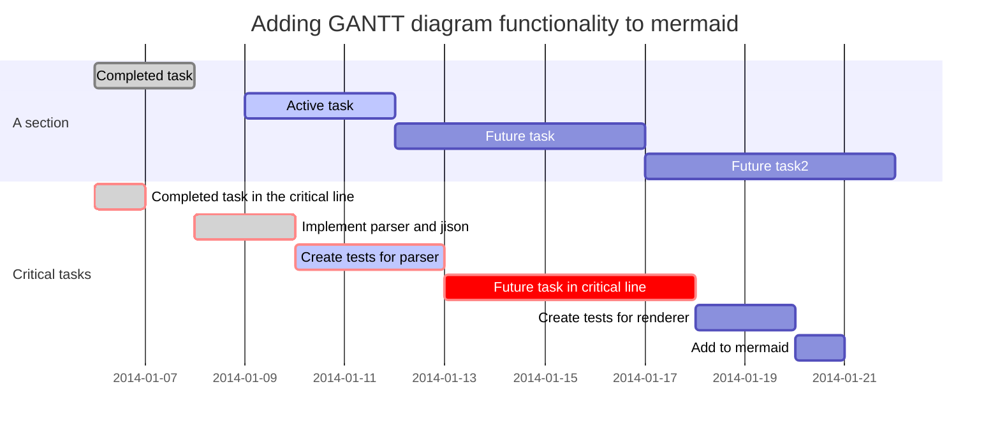

在本博客中使用[mermaid](https://mermaidjs.github.io)将文字渲染成对应的流程图、甘特图等，是非常友好且利于版本管理的方式。具体语法可以参考连接中的文档。页面代码修改可以参考本次提交。

demo代码：

        ```mermaid
        gantt
        dateFormat  YYYY-MM-DD
        title Adding GANTT diagram functionality to mermaid
        section A section
        Completed task            :done,    des1, 2014-01-06,2014-01-08
        Active task               :active,  des2, 2014-01-09, 3d
        Future task               :         des3, after des2, 5d
        Future task2               :         des4, after des3, 5d
        section Critical tasks
        Completed task in the critical line :crit, done, 2014-01-06,24h
        Implement parser and jison          :crit, done, after des1, 2d
        Create tests for parser             :crit, active, 3d
        Future task in critical line        :crit, 5d
        Create tests for renderer           :2d
        Add to mermaid                      :1d
        ```

显示效果：



